# Freewheel Guide for Premium Long-Form Video

As with DFP for digital ads, ad ops will need to configure their `Freewheel server account` so that the server can provide the correct creatives for the video player. If you do not have an account visit [[https://www.freewheel.tv](https://www.freewheel.tv) to create one.

Once your account is set up log in to the [Freewheel site](https://mrm.freewheel.tv/system/account/login). 

You will be presented with a dashboard area. Click on either the `Advertising button` in the top navigation bar or the `Campaign link` in the main body.

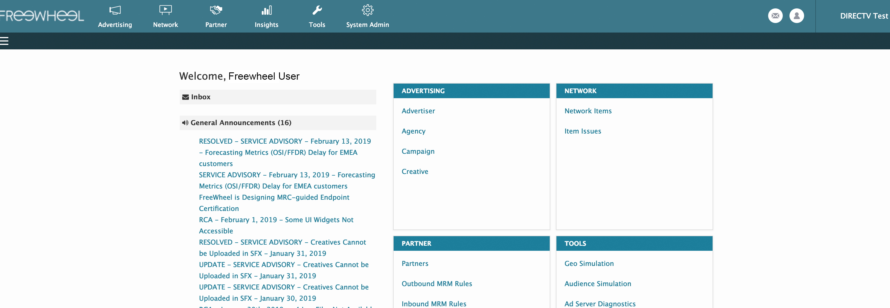

This will display the `Campaign & IO screen`. If you have not established any campaigns yet click the `Add New Campaign link`.

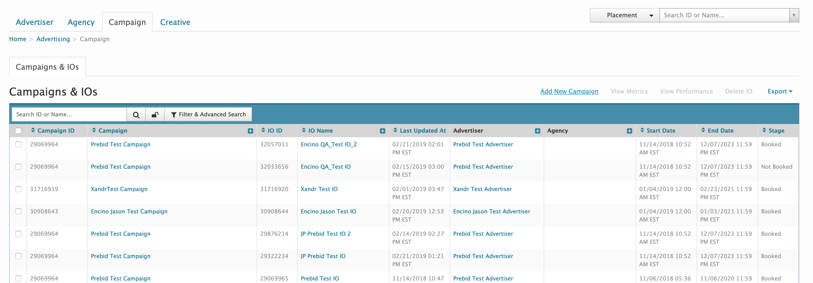

You will be presented with the `Add New Campaign screen`.

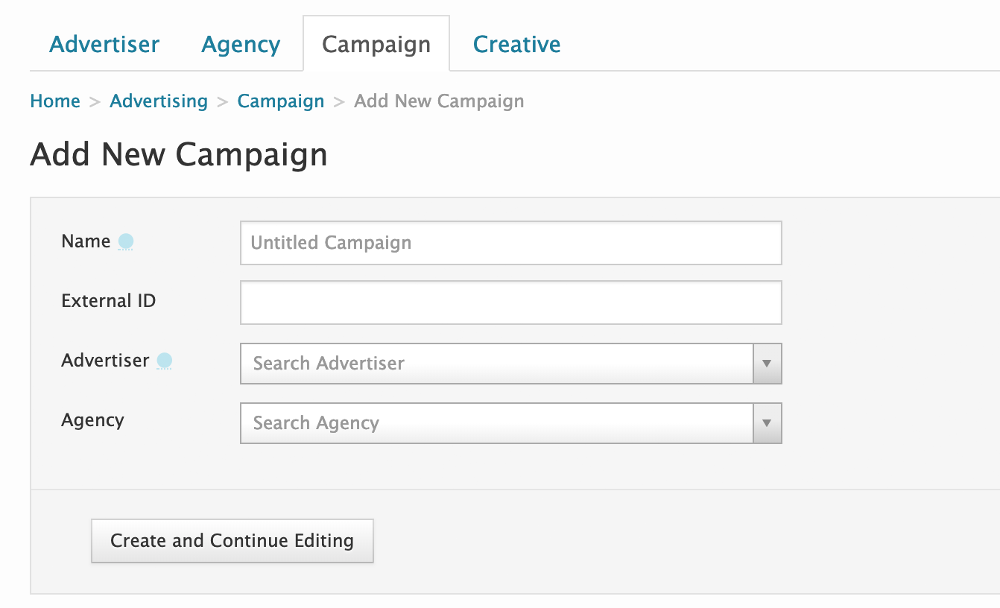  
 - Enter a name for the campaign  
 - Add an external identifier (optional)  
 - Select an Advertiser and Agency from the drop down menus.  
 - Click the `Create and Continue Editing button` when finished.

You will be returned to the `Campaign & IO screen` and your new campaign should appear in the `Campaign & IOs table`. To begin a campaign you will need to create some insertion orders.

Click on the campaign name, which appears in the `Campaign column`. This will present the `Insertion Orders screen`.

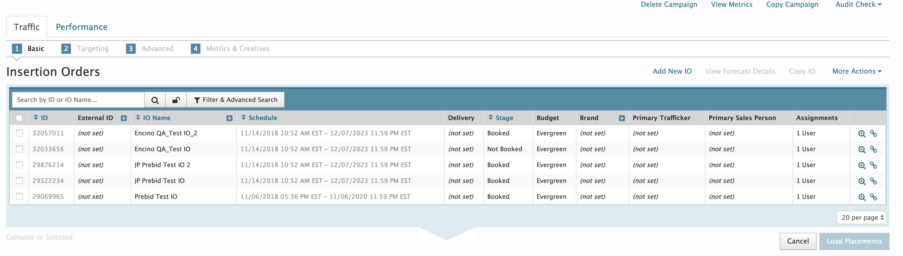

Click on the `Add New IO link`. This will present a pop over for adding a new `Insertion Order`. Enter the relevant information for the new `Insertion Order`. 

Return to the `Campaign & IOs screen` and check the box in the first column of the row containing your IO. Click the `Load Placements button`. This will reload the screen with the details of the `Insertion Order` you selected and the `Placements` for that `Insertion Order`.

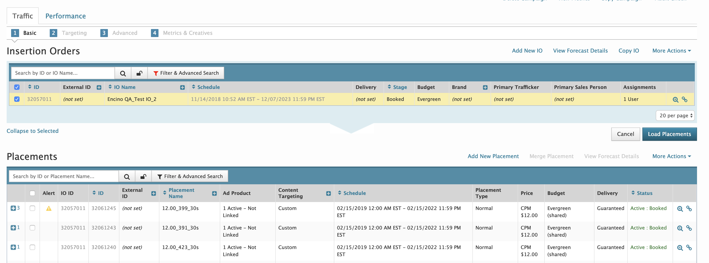

If there are no `Placements` or you want to add a new one click on the `Add New Placement` link. You will be presented with a pop over where you can enter a name and description for the `Placement`. For `Prebid` to interact with `Freewheel's ad server` there is a strict `Placement` naming convention.

The `Freewheel module` within `Prebid` sends key-value targeting pairs to the `Freewheel SDK`, which then forwards them to the `Freewheel server`.

The `Freewheel server` uses those targeting key-value pairs to select the correct `Creatives` to return to `Prebid`. The key-value pairs are written as:

*\'hb\_pb\_cat\_dur\': '12.00\_399\_30s\'*

The value is a concatenation of the CPM (12.00), the `Freewheel industry code` (399) and the ad length in seconds (30s). The name of the `Placement` must be written in the same format:

*12.00\_399\_30s*

Once you have created a `Placement` it will appear in the first row of the `Placement table`.

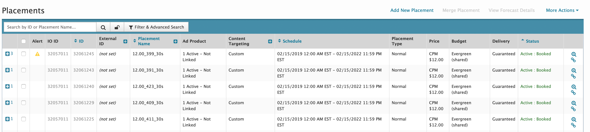

In the last column of each row is a magnifying glass icon. Clicking on that will present detailed information about the `Placement`. In this detailed section information such as `Delivery and Forecast`, `Schedule and Budget`, `Custom Targets`, `Exclusivity` and `Industry` can be set for the `Placement`. The topics relevant to `Prebid` are covered in this section, for detailed information about all settings, visit [Freewheel](Freewheel.tv).

**Schedule and Budget**

The `Schedule and Budget` section enables an ad ops to schedule when the `Placement` will run, the price bucket and the budget type.

Following the naming convention for `Placements`, *12.00\_399\_30s*, the first item in the name represents the CPM (12.00). Ensure that the `Placement Price` matches the CPM. From our example, this should be $12.00. To edit, click on the `Price link`.

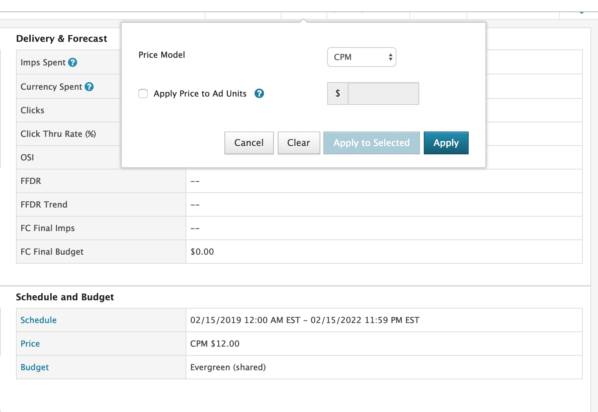

The remaining `Schedule and Budget` values should be set per your campaign requirements.

**Custom Targeting**

The Custom Targeting section is where a custom target will be set to match the key-value pair being passed into the Freewheel server from Prebid. Ensure that the key name matches the Prebid Freewheel key, *hb\_pb\_cat\_dur* and the value matches the naming convention discussed above, containing CPM, industry identifier and duration, *12.00\_399\_30s*. If not, click on the `Custom Targeting` title. A pop over will display enabling you to edit the key and value.\
\
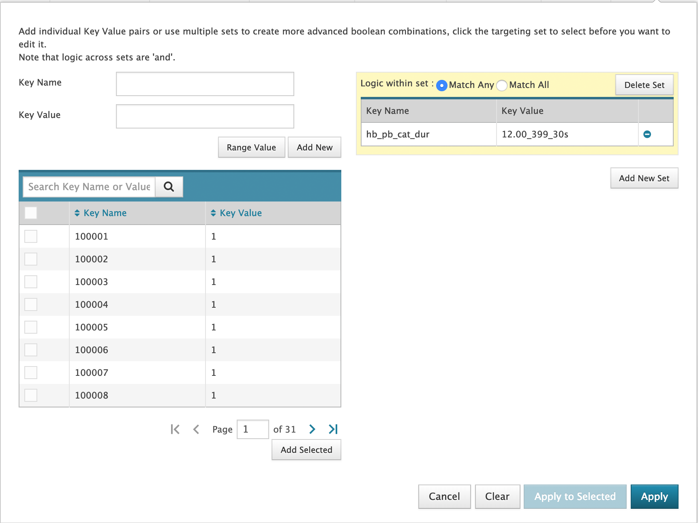

**Industry**

The Industry section enables publishers to set the Industry Group associated with the `Placement`. Ensure that the Industry Group matches the Freewheel industry identifier. If not, click on the `Industry title`, a pop over will display that will enable you to change the Industry Group. For each placement there can only be one Industry Group.

The Industry Group must match the Industry Group Identifier that is contained in the passed in key-value targeting pair. In our example case, that Industry Group Identifier is 399 (12.00\_399\_30s).

**Exclusivity**

`Exclusivity`, or competitve separation, is the process of preventing ads from the same industry group from appearing either adjacent to each other or in the same ad pod.

Scroll to the `Exclusivity` section. Ensure that the `Level of Exclusivity` and `Scope of Exclusivity` is at the desired setting for this `Placement`. Also ensure that the industry displayed matches the industry identifier for this `Placement`. (399 portion of the *12:00\_399\_30s* value). If not, click on the `Exclusivity title`. A pop over will display enabling you to change the `Exclusivity` parameters.

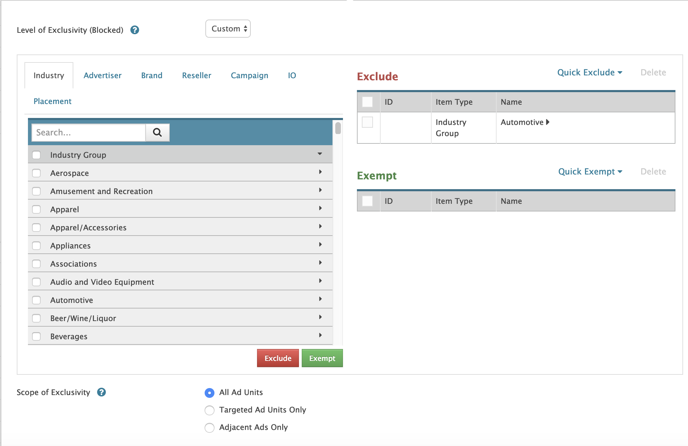

The `Level of Exclusivity` determines the range of ads that fall within the competitive separation rules. There are three options, available from the pop up at the top of the pop over. They are:  
 - **None**: As it implies, none means there is no exclusivity.  
 - **Full**: No other industry ads will appear within the ad pod.  
 - **Custom**: There is a custom exclusivity set up.

Checking the box next to the industry name and clicking the `Exclude button` will add that industry to the list of industries excluded from appearing with this `Placement`. It is recommended that you exclude an industry if the `Placement` intends on delivering ads from that industry.

The `Scope of Exclusivity` determines on what ad types the competitive separation will occur. There are three choices:  
 - **All Ad Units**: Exclusivity is applied to any ad.  
 - **Targeted Ads**: Exclusivity is only applied to targeted ads.  
 - **Adjacent Ads**: Exclusivity is only applied to ads appearing adjacent to this creative. .

**Creatives**

Return to the `Campaign & IO screen` by clicking the `Campaign button`. Click the `Creative button` to the right of the `Campaign button`. This will display the `Creative Library`.

Publishers must create one `Creative` for each ad duration they wish to support. For example, if a publisher will support 15s, 30s, and 60s durations, they will need three creatives, regardless of how many `Placements` they have at that duration.

If there are one hundred `Placements` with 30s durations, only one `Creative` targeting 30s duration is needed.

If there are no creatives in the library click the `Add New Creative button`. A pop over will display enabling you to add a new creative.

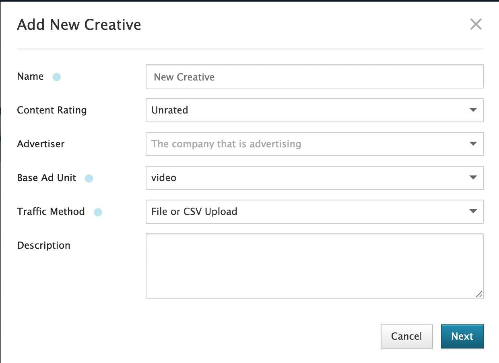

The new `Creative` will appear in the `Creative Library`. Click on the `Creative` name, a new screen will be displayed with information about that `Creative`.

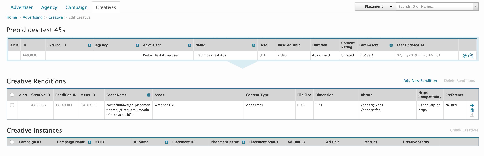

**Duration**

`Duration` determines the length of the `Creative`. This value must match the duration portion of the key-value target passed into `Freewheel server`. The 30s portion of our example *(12:00\_399\_30s)*. If not, click on the `Duration link`. A pop over will display enabling you to enter the correct duration for this `Creative`.

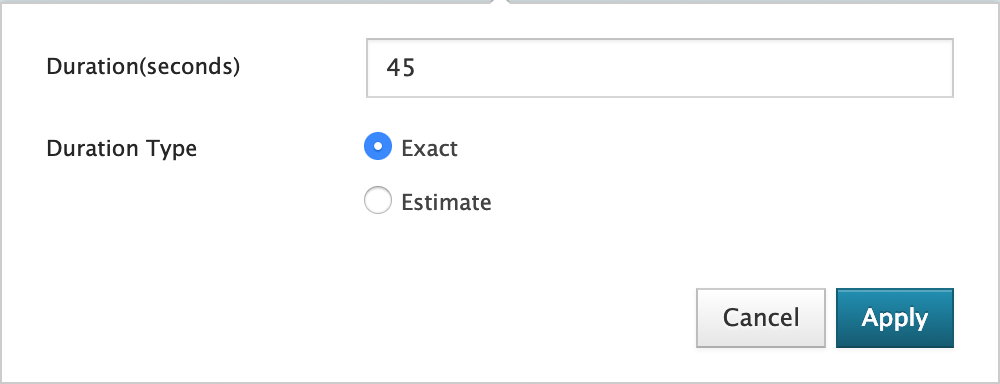{width="6.5in" height="2.496000656167979in"}

For each `Placement` duration you should have one `Creative` that matches. For example, if you had Placements with targeting values of *12:00\_399\_15s*, *12:00\_399\_30s*, and *12:00\_399\_45s*, you should have three `Creatives`, one with a 15 second duration, another with a 30 second duration and a third one with a 45 second duration.

You only need one `Creative` for each `Placement` duration. For example, if you had `Placements` with targeting values of *12:00\_398\_30s*, *12:00\_399\_30s*, and *12:00\_400\_30s* you would only need one `Creative` with a duration of 30 seconds.

**Creative URL**

In order for `Freewheel SDK` to send the correct `Creative` to the video player it needs to request the `VAST XML` stored in Prebid cache. The `Creative` URL has to point to the correct cache location.

To ensure the cache URL is correct there are two macros that dynamically populate the URL query. To confirm the dynamic URL is formatted correctly click on the URL link in the `Detail field`. A pop over will display with the dynamic URL.

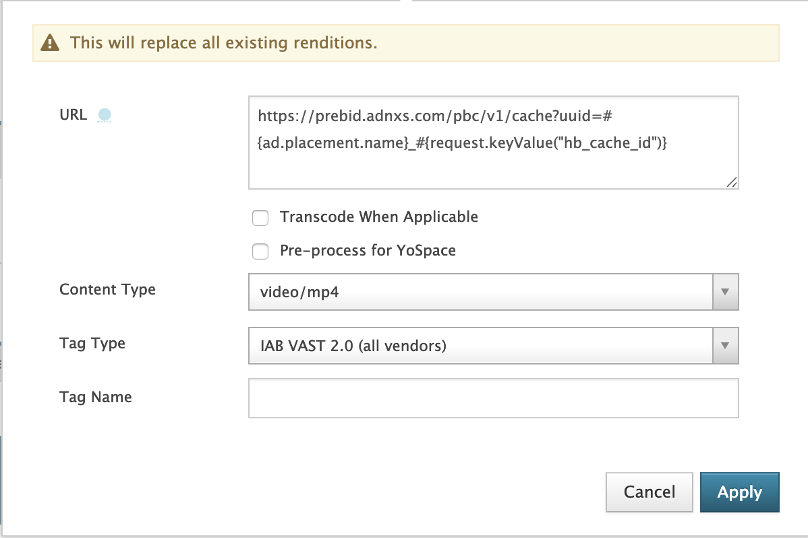

The scheme, host, and path should read as follows:

*https://prebid.adnxs.com/pbc/v1/cache*

The query should have one key-value item:

*uuid=\#{ad.placement.name}\_\#{request.keyValue("hb\_cache\_id\")}*

The first macro, *\#{ad.placement.name}*, will format the `Placement` name. It will be in the `CPM\_IndustryIdentfier\_Duration` format passed in from `Prebid` for targeting and the name used for the `Placement`.

*12.00\_399\_30s*

The second macro, *\#{request.keyValue("hb\_cache\_id")*, formats the unique Prebid cached id.

In real-time, when the dynamic URL is formatted it will appear like so:

*https://prebid.adnxs.com/pbc/v1/cache?uuid=12.00\_391\_30s\_6c422e51-46cf-4b0a-ae41-64c61c1ca125*

In order for the above URL to format correctly ensure that the URL in the text box appears as:

*https://prebid.adnxs.com/pbc/v1/cache?uuid=\#{ad.placement.name}\_\#{request.keyValue(\"hb\_cache\_id\")}*

Your ad ops should now be completed and set up for premium long-form video.
